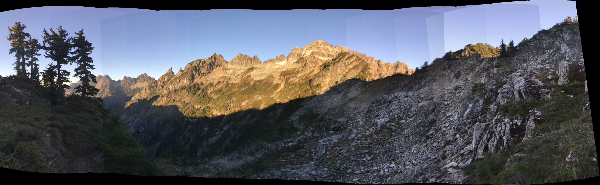
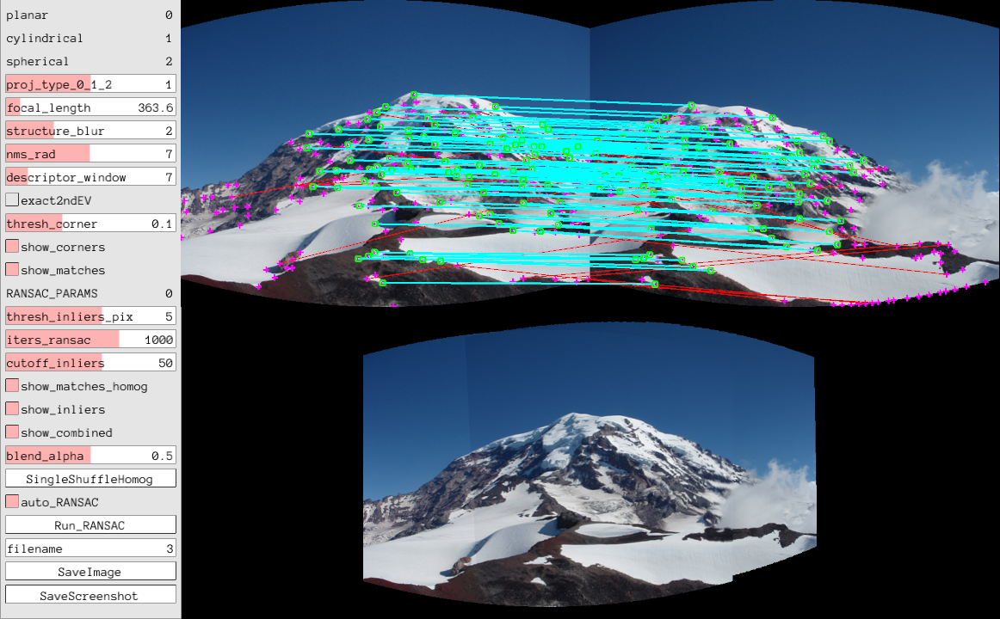
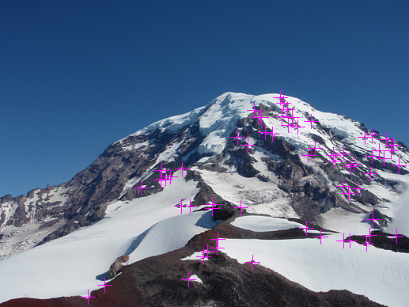
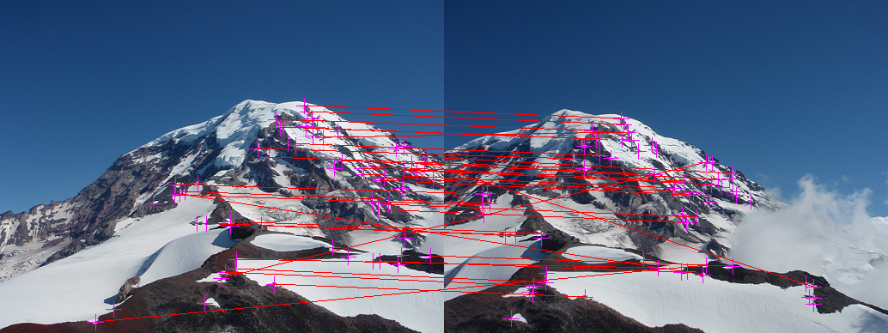
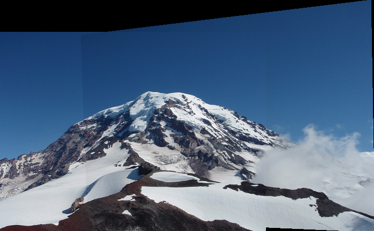
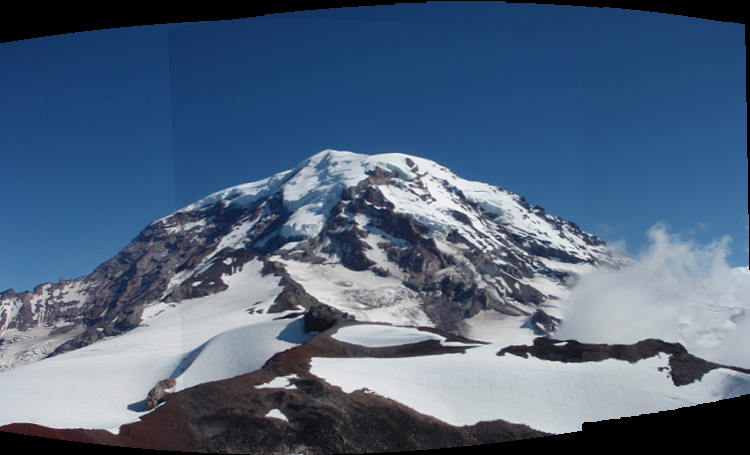

#### NEW: Visual studio solutions provided. More info in section 0.5 ####

# CSE 576 Homework 5 #

Welcome friends,

It's time for assignment 2! This one may be a little harder than the last one so remember to start early and start often!

Copy your `process_image.cpp`, `filter_image.cpp`, and `resize_image.cpp` from HW1 and HW2. You can use `./test1`, `test2` to test your previous code as well. Also `./test5` is provided which is a sample driver program and does some basic tests and runs most parts of your algorithm. If `./test5` runs without errors and produces some panoramic images as well as good matches then it's a good chance that you are about 75% done.

If you want to remove timing information, add `#define TIME(a)` at the end of `utils.h`

## Let's make a panorama! ##

This homework covers a lot, including finding keypoints in an image, describing those key points, matching them to those points in another image, computing the transform from one image to the other, and stitching them together into a panorama.

The high-level algorithm is already done for you! You can find it near the bottom of `src/panorama_image.cpp`, it looks approximately like:

    Image panorama_image(const Image& a, const Image& b, float sigma, int corner_method, float thresh, int window, int nms, float     inlier_thresh, int iters, int cutoff, float acoeff)
      {
      // Calculate corners and descriptors
      vector<Descriptor> ad = harris_corner_detector(a, sigma, thresh, window, nms, corner_method);
      vector<Descriptor> bd = harris_corner_detector(b, sigma, thresh, window, nms, corner_method);

      // Find matches
      vector<Match> m = match_descriptors(ad, bd);

      // Run RANSAC to find the homography
      Matrix Hba = RANSAC(m, inlier_thresh, iters, cutoff);

      // Stitch the images together with the homography
      return combine_images(a, b, Hba, acoeff);
      }

So we'll find the corner points in an image using a Harris corner detector. Then we'll match together the descriptors of those corners. We'll use RANSAC to estimate a projection from one image coordinate system to the other. Finally, we'll stitch together the images using this projection.

First we need to find those corners!

## 0. Visualization with Pangolin ##
In order to help debugging we introduce the functions `detect_and_draw_corners` and `find_and_draw_matches` which visualize the results of the functions that you implemented. Look in `test2.cpp` and in the code as to how to use them.

Also if you want to bring your visualization to the next level we introduce another tool: Pangolin!

It allows you to modify the parameters of your algorithms and visualize the results immediately. To make use of it go to [Pangolin GitHub](https://github.com/stevenlovegrove/Pangolin). Pangolin supports Linux, Windows and MacOS. However, we can only help you install in on Linux, but if you manage to build it on MacOS or Windows please share!

### 0.1 Install Pangolin on Ubuntu or Debian ###
    sudo apt-get install libglew-dev libxkbcommon-dev
    git clone https://github.com/stevenlovegrove/Pangolin.git
    cd Pangolin
    mkdir build
    cd build
    cmake ..
    make -j4

Install any missing dependencies.

### 0.2 Install Pangolin on Fedora or CentOS (Including CSE VM) ###
    sudo yum install glew-devel.x86_64
    git clone https://github.com/stevenlovegrove/Pangolin.git
    cd Pangolin
    mkdir build
    cd build
    cmake ..
    make -j4

Install any missing dependencies.

### 0.3 Install Pangolin on CSE machines without root access ###
    git clone https://github.com/stevenlovegrove/Pangolin.git
    cd Pangolin
    mkdir build
    cd build

    #### CHANGE NEXT LINE
    hw2dir=/home/swetko/cse576/cse457-hw5-2020 #### PUT YOUR cse576-hw5-2020 folder here!!!
    #### CHANGE PREVIOUS LINE

    cmake .. -DGLEW_INCLUDE_DIR=$hw2dir/glew/include/ -DGLEW_LIBRARY=$hw2dir/glew/lib/libGLEW.so -DGLEW_FOUND=TRUE
    make -j4

### 0.4 Install Pangolin on MacOS ###
Here's a link that might help: [Pangolin GitHub macOS issue](https://github.com/stevenlovegrove/Pangolin/issues/298)

### 0.5 Install Pangolin on Windows ###
You can find Visual Studio Solution for this homework in the `/vs/cse576-hw5` subfolder. It includes the pangolin library itself in `/vs`.
You might have to retarget each project if you are using a different version of VS or whatever. VS will suggest the proper version automatically. The problem is that we are supplying Pangolin compiled with a specific version of VS and your project has to match it.

IMPORTANT: Once you compile the visualization tools, try running them. If you get just a black window, try resizing the window. That should make the GUI appear.

### 0.6 Set up your project ###
On linux once you compile Pangolin, it should be found by our project.

    cd cse455-hw2
    cd build
    cmake ..

You should see this output if Pangolin is found

    ---------------------------------------------
    Pangolin found!!!!
    Building WITH Visualization
    ---------------------------------------------

### 0.7 Useful shortcuts ###
You can use scroll to zoom in/out in pictures. Try zooming in A LOT and pressing 'n'. That switches between NN and Bilinear display of the images in pangolin. You can use right click to move the image around and left click to select regions. Try selecting a region and pressing 'a'. Try different regions! Do you notice what's happening? It normalizes the intensity so the patch you selected is between 0 and 1. This way you can inspect underexposed pictures, etc. Try pressing 'b' in a region! Look in the command line! It shows the min/max value in region!

## 1. Harris corner detection ##

We'll be implementing Harris corner detection as discussed in class. The basic algorithm is:

    Calculate image derivatives Ix and Iy.
    Calculate measures IxIx, IyIy, and IxIy.
    Calculate structure matrix components as weighted sum of nearby measures.
    Calculate Harris "cornerness" as estimate of 2nd eigenvalue: det(S)/tr(S)
              Alternatively (Optionally) find the exact 2nd eigenvalue
    Run non-max suppression on response map

## 1.1 Compute the structure matrix ##

Fill in `Image structure_matrix(const Image& im2, float sigma)` in `harris_image.cpp`. This will perform the first 3 steps of the algorithm: calculating derivatives, the corresponding measures, and the weighted sum of nearby derivative information. As discussed in class, this weighted sum can be easily computed with a Gaussian blur. For gradients use the sobel filters (slightly smoothed versions of the regular -101 filter). You should use your `make_gx_filter` and `make_gy_filter` from HW2.

### 1.1b Make a fast smoother ###

You want a fast corner detector! You have to decompose the Gaussian blur from one large 2d convolution to 2 1d convolutions. Instead of using an N x N filter you should convolve with a 1 x N filter followed by the same filter flipped to be N x 1.

Fill in `Image make_1d_gaussian(float sigma)` and `Image smooth_image(const Image& im, float sigma)` to use this decomposed Gaussian smoothing.

## 1.2 Computer cornerness from structure matrix ##

Fill in `Image cornerness_response(const Image& S, int method)`. Return `det(S)/tr(S)` for each pixel, if `method==0`, or if `method==1` return exact 2nd eigenvalue. The case of `method==1` is optional.

## 1.3 Non-maximum suppression ##

We only want local maximum responses to our corner detector so that the matching is easier. Fill in `Image nms_image(const Image& im, int w)`.

For every pixel in `im`, check every neighbor within `w` pixels (Chebyshev distance). Equivalently, check the `2w+1` window centered at each pixel. If any responses are stronger, suppress that pixel's response (set it to a very low negative number).

## 1.4 Complete the Harris detector ##

Fill in the missing sections of `vector<Descriptor> detect_corners(const Image& im, const Image& nms, float thresh, int window)`. The function should return an vector of descriptors for corners in the image. Code for calculating the descriptors is provided, though you can vary the size of the described window around each corner with the parameter `window`.

After you complete this function you should be able to calculate corners and descriptors for an image! Try running:

    Image im = load_image("data/Rainier1.png");
    Image corners=detect_and_draw_corners(im, 2, 0.2, 5, 3, 0);
    save_image(corners, "output/corners");

This will detect corners using a Gaussian window of 2 sigma, a "cornerness" threshold of 100, and an nms distance of 3 (or window of 7x7). It should give you something like this:

Corners are marked with the crosses. They seem pretty sensible! Lots of corners near where snow meets rock and such. Try playing with the different values to see how the affect our corner detector.

## 2 Patch matching ##

To get a panorama we have to match up the corner detections with their appropriate counterpart in the other image. The descriptor code is already written for you. It consists of nearby pixels except with the center pixel value subtracted. This gives us some small amount of invariance to lighting conditions. Note that the function `Descriptor describe_index(const Image& im, int x, int y, int w)` also take as a parameter the window for the size of the descriptor.

The rest of the homework takes place in `src/panorama_image.cpp`.

## 2.1 Distance metric ##
For comparing patches we'll use L1 distance. Squared error (L2 distance) can be problematic with outliers as we saw in class. We don't want a few rogue pixels to throw off our matching function. L1 distance (sum absolute difference) is better behaved with some outliers.

Implement float `l1_distance(float *a, float *b, int n)` between two vectors of floats. The vectors and how many values they contain is passed in.

## 2.2a Find the best matches from A to B ##

First we'll look through descriptors for `Image a` and find their best match with descriptors from `Image b`. Fill in `vector<int> match_descriptors_a2b(const vector<Descriptor>& a, const vector<Descriptor>& b)`.

## 2.2b Eliminate non-symmetric matches  ##

`match_descriptors_a2b` finds the best match in `b` for each descriptor in `a`. What if that descriptor in `b` itself has a better match in `a`. Be a good matchmaker and find the matches between the descriptors in `a[]` and `b[]`, such that each descriptor in a match is the best for other.

Once this is done we can show the matches we discover between the images:

    Image a = load_image("data/Rainier1.png");
    Image b = load_image("data/Rainier2.png");
    Image m = find_and_draw_matches(a, b, 2, 0.4, 7, 3, 0);
    save_image(m, "output/matches");

Which gives you:

## 3. Fitting our projection to the data ##

Now that we have some matches we need to predict the projection between these two sets of points! However, this can be hard because we have a lot of noisy matches. Many of them are correct but we also have some outliers hiding in the data.

## 3.1 Projecting points with a homography ##

Implement `Point project_point(const Matrix& H, const Point& p)` to project a point using matrix `H`. You can do this with the provided matrix library (see `src/matrix.cpp` and `src/matrix.h`). We have overloaded some operators and shortcuts for vectors. Interface is similar to Matlab matrix ops. Or you could pull out elements of the matrix and do the math yourself. Whatever you want! Just remember to do the proper normalization for converting from homogeneous coordinates back to image coordinates. (We talked about this in class).

## 3.2a  Calculate distances between points ##

`double point_distance(const Point& p, const Point& q)`. L2 distance. You know the formula.

## 3.2b Calculate model inliers ##

Figure out how many matches are inliers to a model. Fill in `vector<Match> model_inliers(const Matrix& H, const vector<Match>& m, float thresh)` to loop over the points, project using the homography, and check if the projected point is within some `thresh` old distance of the actual matching point in the other image. Return a `vector<Match>` of the inliers.

## 3.3 Randomize the matches ##

One of the steps in RANSAC is drawing random matches to estimate a new model. One easy way to do this is randomly shuffle the array of matches and then take the first `n` elements to fit a model.

Implement the [Fisher-Yates shuffle](https://en.wikipedia.org/wiki/Fisher%E2%80%93Yates_shuffle#The_modern_algorithm) in `void randomize_matches(vector<Match>& m)`.

## 3.4 Fitting the homography ##

We will solve for the homography using the matrix operations discussed in class to solve equations like `M a = b`. Most of this is already implemented, you just have to fill in the matrices `M` and `b` with our match information in the first TODO in `Matrix compute_homography_ba(const vector<Match>& matches)`.

You also have to read out the final results and populate our homography matrix. Consult the slides for details about what should go where, or derive it for yourself using the projection equations!

## 3.5 Implement RANSAC ##

Implement the RANSAC algorithm discussed in class in `Matrix RANSAC(vector<Match> m, float thresh, int k, int cutoff)`. Pseudocode is provided.

## 3.6 Combine the images with a homography ##

Now we have to stitch the images together with our homography! Given two images and a homography, stitch them together with `Image combine_images(const Image& a, const Image& b, const Matrix& Hba, float ablendcoeff)`.

Some of this is already filled in. The first step is to figure out the bounds to the image. To do this we'll project the corners of `b` back onto the coordinate system for `a` using `Hinv`. Then we can figure out our "new" coordinates and where to put `Image a` on the canvas. Paste `a` in the appropriate spot in the canvas.

Next we need to loop over pixels that might map to `Image b`, perform the mapping to see if they do, and if so fill in the pixels with the appropriate color from `b`. Our mapping will likely land between pixel values in `b` so use bilinear interpolation to compute the pixel value (good thing you already implemented this!).

Where the two images overlap (How do we check for that?) implement blending. Scale the pixel from `a` with `ablendcoeff` and the pixels coming from `b` with `1-ablendcoeff`.

With all this working you should be able to create some basic panoramas:

    Image im1 = load_image("data/Rainier1.png");
    Image im2 = load_image("data/Rainier2.png");
    Image pan=panorama_image(a,b,2,0,0.3,7,3,5,1000,50,0.5);
    save_image(pan, "easy_panorama");

## 4 Projections ##
Mapping all the images back to the same coordinates is bad for large field-of-view panoramas, as discussed in class. Our pipeline is going to change by reprojecting out images to different coordinates before inputting them to `panorama_image`.

### 4.1 Cylindrical ###
 Implement `Image cylindrical_project(const Image& im, float f)` to project an image to cylindrical coordinates and then unroll it. Then stitch together some very big panoramas (the `field*.jpg` panorama)

    Image pan=panorama_image(cylindrical_project(a,500),cylindrical_project(b,500),2,0,0.3,7,3,5,1000,50,0.5);
    save_image(pan, "easy_panorama_cyl");

### 4.2 Spherical (Extra credit) ###
Implement `Image spherical_project(const Image& im, float f)` to project an image to spherical coordinates and then unwarp it. Then stitch together some very big panoramas (the `field*.jpg` panorama)

    Image pan=panorama_image(spherical_project(a,500),spherical_project(b,500),2,0,0.3,7,3,5,1000,50,0.5);
    save_image(pan, "easy_panorama_sphere");

### 4.3 Discussion ###
Will the same `combine_images` function work with different projections? What are the significant changes that we have to make?

What is the correct way to find the transformation between the two images in non-planar coordinates?

What are the equivalent transformations in spherical and cylindrical coordinates to `scaling`, `translation`, `shear`, `rotation`, etc.

Will the same algorithm for computing homography work with different projections?

Does homography even exist in the cylindrical and spherical case?

## 5 Making panoramas and extra credit ##

#### 5.1 Make some panoramas ####
In order to get perfect grade you not only need to implement each feature of the algorithm but be able to run it to stitch multiple images together. We have provided the program `make-panorama` that can calls your basic function `make_panorama` to create complex panoramas. You would need to choose the parameters of your algorithm. Make sure that the parameters are such that your algorithm can stitch complex panos. If necessary use the `panorama` GUI to help with parameter choosing. Some of the functions are implemented there and some not. For `sun` and `helens` you have to choose the order of stitching yourself. At the end you should make the necessary changes to `panorama.cpp` so that when we call

    ./make-panorama rainier
    ./make-panorama sun
    ./make-panorama helens
    ./make-panorama field
    ./make-panorama columbia

We get `output/XXX/all.png` that looks stiched well (small imperfection such as in `columbia-all.jpg` are acceptable).

#### 5.2 Extra credit ####
1. Implement exact 2nd eigenvalue! - 5pts.
2. Implement spherical projection! - 5pts.
3. Make panorama with all at least a set of 8 pics of yours. - 5 pts. You might need to tweak the parameters, such as the focal length when loading the images and the projection that you want to produce the images in. For that you might want to use the GUI tools to see your results in realtime. Or use this link: [How to measure focal length.](https://www.lightandmatter.org/2015/tech-photography-articles/how-to-calculate-a-lens-focal-length-slightly-simplified/). Make sure you convert your measurements to pixels as opposed to millimeters. Additionally you can refer to Rick's textbook, chapter 11.1.3 on how to use homography to calculate the focal length.

#### 5.3 For Fun ####
Play with `make-panorama wall/cse/columbia`. Can you stitch them? If not why? Is it because of bad projections? Try `wall`. This contains archaeological writings from the last few years and makes for a nice flat panorama. Remember, homography should only work on flat surfaces!! Try stitching any two overlapping images. Notice how perfect the stitching is?? Now try to do more! Notice any problems? Why is that? Do we need better features (sift?) ? Why does geometry looks so distorted?? Wasn't homography fine for flat surfaces? What's going on?? Can you figure out a way to fix it?

You are not graded on this, but highly recommended to play with those. It'll help you get a lot of intuition about cameras, 3d/2d geometry and projections and features. Making a panorama software has so many components!!

## 6 Turn it in and Grading ##

#### 6.1 What to turn in ####
You should have to modify only `harris_image.cpp`, `panorama_image.cpp` and `test\panorama.cpp`. You should submit just these 3 files and your optional panorama. We are going to test each function separately to give you partial credit.

#### 6.2 Grading ####
    make_1d_gaussian     3
    smooth_image         5
    structure_matrix     6
    cornerness_response  3
    nms_image            3
    detect_corners       4
                        24

    l1_distance              1
    match_descriptors_a2b    5
    match_descriptors        5
    project_point            3
    point_distance           1
    model_inliers            5
    randomize_matches        2
    compute_homography_ba    8
    RANSAC                   8
    combine_images           11
    cylindrical_project      7
                            56

    ./make-panorama rainier    4 (easy case, have to stitch all of them)
    ./make-panorama sun        4 (easy case, have to stitch all of them)
    ./make-panorama helens     4 (easy case, have to stitch all of them)
    ./make-panorama field      4 (harder, have to stitch just 6 of them, using cylindrical)
    ./make-panorama columbia   4 (this is harder, but if your implementation is good you would get a big mountain panorama)
                              20

    EXTRA CREDIT:

    spherical_project            5  OPTIONAL                         
    exact_eigenvalue,method=1    5  OPTIONAL
    your panorama                5 OPTIONAL
